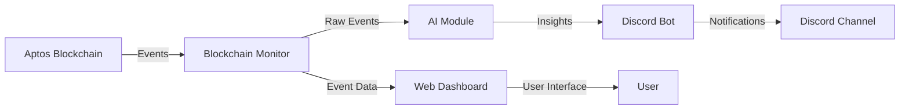
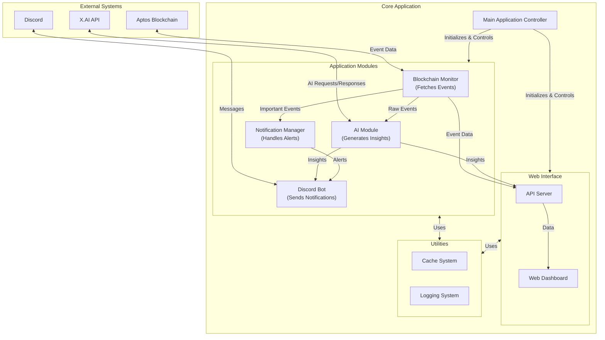

# Cultivate: Aptos Blockchain Monitor

Cultivate is a real-time monitoring tool for the Aptos blockchain that tracks important events and delivers insights through a web dashboard and Discord notifications.

## What It Does

- **Tracks Blockchain Events**: Monitors the Aptos blockchain for important events like token transfers, NFT sales, and price movements
- **AI-Powered Insights**: Analyzes events and generates easy-to-understand explanations
- **Real-Time Notifications**: Sends alerts to Discord when significant events occur
- **Interactive Dashboard**: Provides a web interface to view and filter blockchain events

## Architecture

### High-Level Overview

The diagram below shows how Cultivate works at a high level:



1. **Data Collection**: The Blockchain Monitor watches the Aptos blockchain for interesting events
2. **Analysis**: The AI Module examines these events and creates easy-to-understand explanations
3. **Communication**: The Discord Bot shares these insights in your Discord channel
4. **Visualization**: The Web Dashboard displays all events and insights in a user-friendly interface

### Detailed Architecture

This diagram shows the internal workings of Cultivate:



#### How Data Flows Through the System:

1. **Collection**: The Blockchain Monitor continuously checks the Aptos blockchain for new events
2. **Processing**: When events are found, they're stored and analyzed for importance
3. **Enhancement**: The AI Module uses X.AI's powerful models to generate human-friendly explanations
4. **Distribution**: Important events are sent to Discord and made available on the web dashboard
5. **Interaction**: Users can view events, filter them, and get more information through the web interface or Discord commands

This architecture ensures that Cultivate is:
- **Modular**: Each component has a specific job and can be improved independently
- **Scalable**: The system can handle more events or users as needed
- **Reliable**: If one part has a problem, the others can continue working

## Getting Started

### Requirements

- Python 3.10+
- Discord account and bot token
- X.AI API key (for AI-powered insights)

### Setup

1. Clone the repository:
   ```
   git clone https://github.com/yourusername/cultivate.git
   cd cultivate
   ```

2. Install dependencies:
   ```
   pip install -r requirements.txt
   ```

3. Create a `.env` file with your configuration:
   ```
   # Blockchain configuration
   APTOS_NODE_URL=https://fullnode.mainnet.aptoslabs.com/v1
   APTOS_NETWORK=mainnet
   POLLING_INTERVAL=60

   # Discord configuration
   DISCORD_BOT_TOKEN=your_discord_bot_token
   DISCORD_CHANNEL_ID=your_discord_channel_id
   DISCORD_PREFIX=!

   # X.AI configuration
   XAI_API_KEY=your_xai_api_key
   XAI_API_URL=https://api.x.ai/v1
   GROK_MODEL=grok-2-latest
   AI_TEMPERATURE=0.7

   # Discord webhook for notifications
   DISCORD_WEBHOOK_URL=your_discord_webhook_url
   DISCORD_NOTIFICATION_THRESHOLD=0.8

   # API configuration
   PORT=5000
   HOST=0.0.0.0
   ```

4. Run the application:
   ```
   python -m main
   ```

5. Access the dashboard at `http://localhost:5000`

## Using the Discord Bot

The Discord bot provides several commands to interact with the blockchain monitor:

- `!events [count]` - Shows recent blockchain events (default: 5)
- `!status` - Shows the current status of the blockchain monitor
- `!metrics` - Shows blockchain metrics and statistics
- `!custom_help` - Shows help information

Use these commands in the designated bot channel to get real-time information about blockchain events.

## Project Structure

- `modules/` - Core functionality modules
  - `blockchain.py` - Blockchain monitoring and event processing
  - `ai.py` - AI-powered insights generation
  - `discord_bot.py` - Discord bot for notifications
  - `notification.py` - Notification handling
- `api/` - Web API and dashboard
- `utils/` - Utility functions
- `tests/` - Test suite
- `documentation/` - Project documentation

## Troubleshooting

- **UI Shows Offline**: Refresh the page or check if the application is running
- **No Events Showing**: The application may need time to detect events, or try generating test events with `python test_events.py`
- **Discord Bot Not Responding**: Ensure your bot token is correct and the bot has proper permissions


